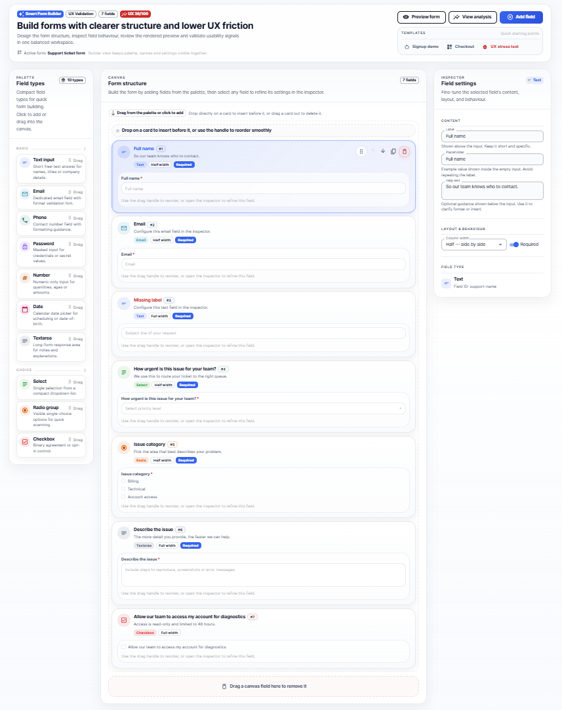
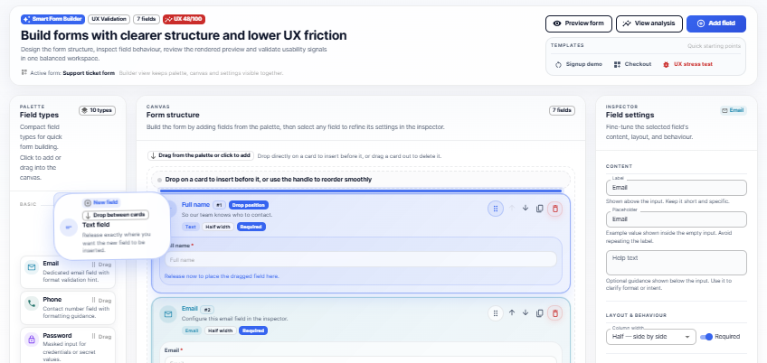
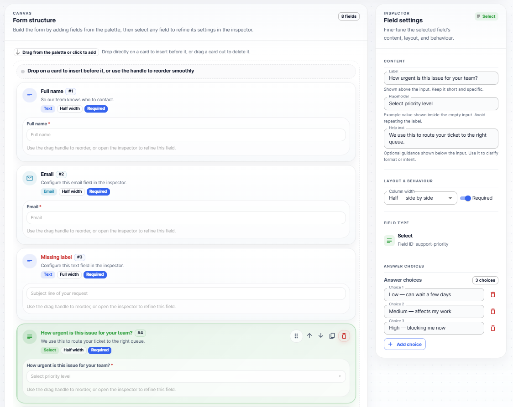
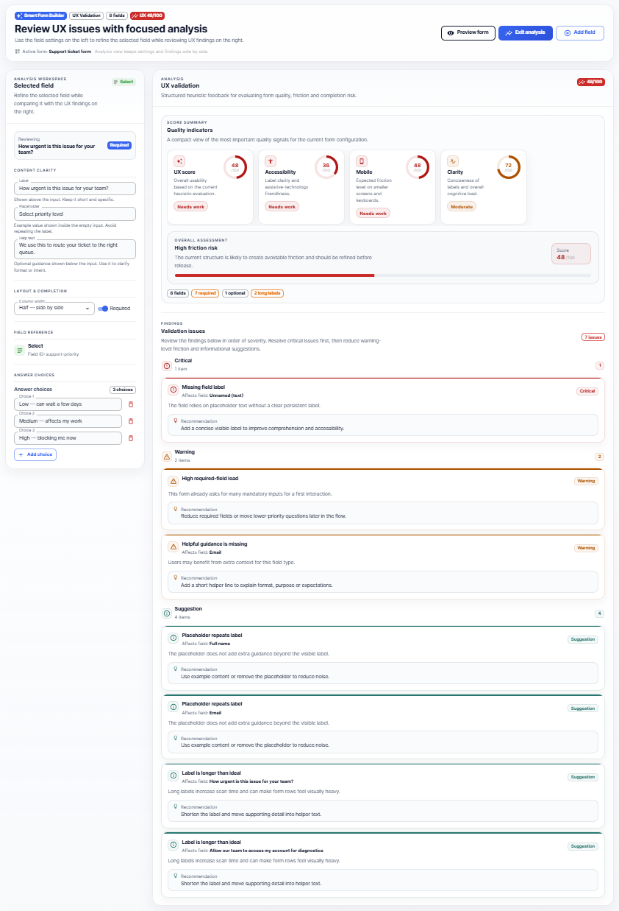

<div align="center">

# Smart Form Builder

Design better forms with a visual workspace built for speed, clarity, and confident iteration.



</div>

Smart Form Builder is a modern form design experience that combines visual structure editing, field configuration, live preview, and UX feedback in one focused interface. It helps teams create forms faster, maintain consistency, and review usability before implementation.

## Overview

Building high-quality forms often requires switching between planning, editing, previewing, and reviewing. Smart Form Builder brings these steps together in a single product experience so teams can move from idea to polished form with less friction.

It is designed for product teams, designers, frontend teams, and internal platform owners who want a more visual and efficient way to create form experiences.

## Product Highlights

- **Visual drag-and-drop builder** for arranging form fields quickly
- **Central canvas workspace** for structuring forms with clarity
- **Inspector-driven editing** for labels, placeholders, help text, width, and required states
- **Live preview** to review the form as users would experience it
- **UX analysis panel** with quality signals and recommendations
- **Fast iteration workflow** for testing structure and content decisions in real time
- **Modern interface** built for a clean, focused product experience

## Product Experience

### Build Visually

Create and organize forms in a central canvas using intuitive drag-and-drop interactions. Add fields, reorder them instantly, and remove them naturally by dragging them out of the canvas area.

### Refine Every Field

Use the inspector to adjust field details without breaking your flow. Update labels, helper text, placeholders, layout width, and required settings from one dedicated editing panel.

### Preview Before Delivery

Switch to preview mode to validate the form experience before handoff or implementation. This makes it easier to review structure, readability, and overall flow.

### Review UX Quality

Analyze the form with built-in scoring and recommendations that help identify opportunities to improve clarity and usability.

## Screenshots

### Product Overview


A complete view of the workspace with the field library, builder canvas, and inspector panel presented together.

### Builder Canvas



The central form-building area where fields can be arranged, reordered, and removed through direct manipulation.

### Field Configuration



The inspector experience for refining labels, placeholders, helper text, layout width, and required settings.

### Live Preview


A rendered preview of the form experience, helping teams validate structure and readability before delivery.

### UX Analysis



A dedicated analysis view with score cards and recommendations to support better usability decisions.

## Core Capabilities

### Visual Form Composition

Smart Form Builder enables teams to assemble forms through a direct manipulation interface instead of relying only on raw configuration.

### Structured Editing Workflow

The product separates building, editing, previewing, and reviewing into clear interface zones that support faster decision-making.

### Real-Time Feedback Loop

Changes made in the builder can be reviewed immediately in preview and analysis views, helping teams iterate with more confidence.

### Scalable Product Foundation

The current experience provides a strong base for future capabilities such as templates, persistence, validation rules, collaboration, and AI-assisted suggestions.

## Ideal Use Cases

- Internal tools that need a configurable form builder experience
- Product teams exploring form workflows before backend integration
- Design system teams validating form patterns and usability
- Admin platforms that require flexible form composition
- Prototypes and MVPs for workflow-heavy applications

## Technology Foundation

Smart Form Builder is implemented with a modern frontend stack centered on [`React`](package.json), [`TypeScript`](package.json), [`Vite`](package.json), [`MUI`](package.json), [`Zustand`](package.json), and [`dnd-kit`](package.json).

This repository currently represents the frontend product experience and can serve as a strong base for expansion into a full platform.

## Getting Started

### Prerequisites

- Node.js 18+
- npm 9+

### Install

```bash
npm install
```

### Run Locally

```bash
npm run dev
```

### Build

```bash
npm run build
```

Available scripts are defined in [`package.json`](package.json).

## Architecture Reference

For implementation and project structure details, see [`ARCHITECTURE.md`](ARCHITECTURE.md).

## License

This project is licensed under [`LICENSE`](LICENSE).

## Suggested Repository Description

A modern visual form builder with drag-and-drop editing, live preview, and UX analysis in one product experience.
